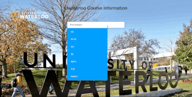

# UWaterloo-Subject-Info
Find information about any UWaterloo course. Using React, this project utilizes the university's public API and Facebook's Fixed Data Tables.
## Demo
[](demo/uwci-demo.gif)

## SetUp
Clone this repo and set up your react environment. Install the required node modules.
```
npm install
```
Within terminal, cd into frontend and run
```
npm start
```
From there, travel to localhost:8080 and just find your subjects and courses.
